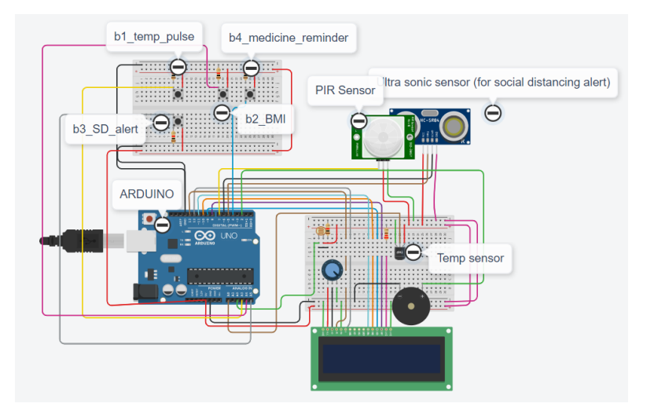
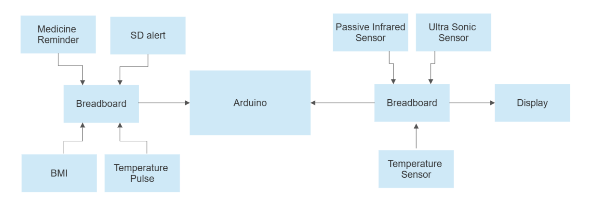

<h3 align="center">Smart_Healthcare_IoT_Research_Project</h3> 

    This project focuses on the development of an Internet of Things (IoT)-based healthcare monitoring system. The system employs various sensors to monitor vital signs like body temperature, BMI, and human presence for applications in smart healthcare.
     
     
    <a href="https://www.tinkercad.com/things/2uoqGiNoDGG-copy-of-smart-health-monitoring-system-mandiproject/editel?sharecode=aS7A3MhqMH9NHqq5BsHDIhsB-xyrxhdzcLJeucD9kfM">To view the demo.</a>  
    <a href="https://rspsciencehub.com/article_23861.html">To view the paper.</a>
  

 
## Authors

Durga Sritha Dongla (Contact: ddongla@gitam.in)  
Durga Abhiram Gorle (Contact: dgorle@gitam.in)  
Rishita Kakarlapudi (Contact: rkakarla@gitam.in)  
Naresh P (Contact: npatnana@gitam.edu)  

## Publication Information

Title: Advancement of Smart Healthcare Monitoring Systems in an IoT-based Environment  
Journal: RSP Science Hub  
International Research Journal on Advanced Science Hub  
Volume: 05, Issue: 05S, May  
DOI: 10.47392/irjash.2023.S061  

## Abstract

With the growth of technology, there have been many improvements in people’s
quality of life. New technologies have been implemented in the healthcare sector in one such area. Healthcare practitioners and experts are taking significant steps to use these emerging technologies to improve healthcare delivery
significantly. The IoT has been at the core of many emerging healthcare technologies, e.g., B. heartbeat sensors, EKGs, and blood pressure sensors, each
having different microcontrollers that read data from the sensors, which can be
interpreted as needed. Advantageously, healthcare services have become quite
expensive for people. That being said, most people need help understanding
how these advanced healthcare systems work. As a result, they have to rely
on doctors to understand what is being inferred constantly. Therefore, to combat this increasing problem, we have developed a remote healthcare system
that uses sensors to derive the patient’s vital signs and makes this data more
accessible to the general public. Our primary focus was to work on a simplified mechanism to help the patient’s family to check the patient’s condition
continuously. The device will be able to calculate the BMI, Body temperature
of the Individual, Human Detection for Social Distancing, and give Medical
Reminders.
In summary, the health monitoring system works so that the controller collects
data via sensors and sends them to the cloud. The data is then processed and
examined for remote viewing. The analyzed data will be sent to the guardians,
doctors, and family members for viewing.

## Circuit Diagram :

## Block Diagram :

